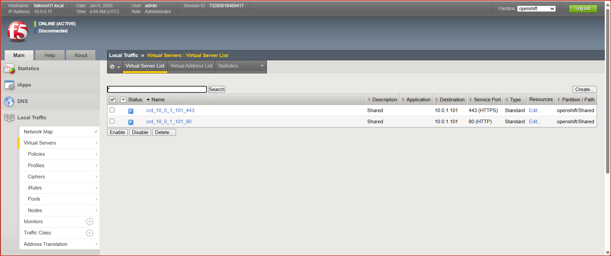
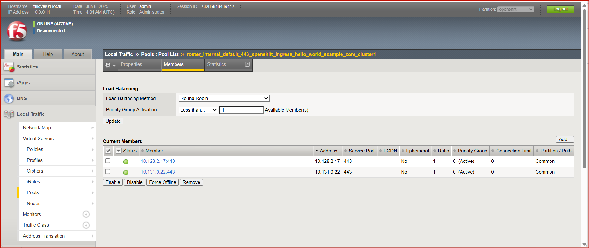
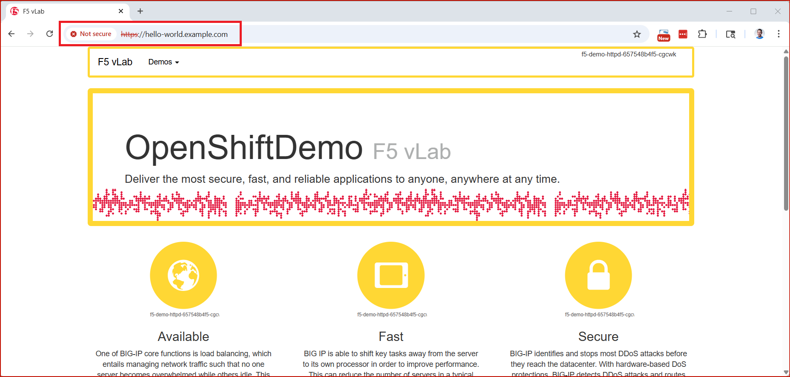
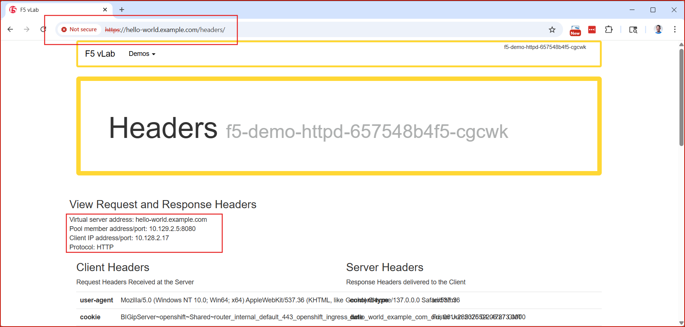

## Example overview

This example contains **working, tested** manifests that configure
- CIS in Multi-cluster mode (but only 1 cluster exists in my testing)
  - CIS is in standalone mode (there is only 1 CIS instance running, not multiple CIS instances across clusters)
  - there is a extended-spec-configmap defining 3 clusters, however in testing only cluster1 actually existed, cluster2 and 3 did not exist.
  - The VirtualServer (VS) custom resource (CR) must specify the "multiClusterServices" configuration under the pool setting
- A secure https VS CR
  - tlsProfile is also included, termination type is `reencrypt`
  - httpTraffic is set to `redirect`, so a port 80 VIP is created for redirect to port 443
  - the pool members for our VIP on BIG-IP are the haproxy routers in OpenShift.
- A demo app that can be run in OpenShift (eg doesn't bind to port 80)
  - demo app listens on 8443 (https) and 8080 (http)

## Example architecture

- In this demo, traffic flow is as follows:
  - client makes *https* request to BIG-IP
    - if client makes *http* request, a 302-redirect is served by BIG-IP and client re-requests with *https*
  - BIG-IP decrypts TLS, performs Layer 7 tasks (inserts headers, etc), then reencrypts traffic for next hop
  - BIG-IP sends *https* traffic to HAProxy
  - HAProxy decrypts TLS and routes to app pods based on Layer 7 attributes (host header, etc)

```
                        ----------                 -----------------------------------
Client --> (https) -->  | BIG-IP | --> (https) --> | HAProxy --> (http) --> App pods |
                        ----------                 -----------------------------------
```

## Reminders of configuration objects used here
1. **VirtualServer** CRD configures a single VIP on BIG-IP, with pool members of HAProxy pods in cluster
  - in this example, I've created the VS in the `openshift-ingress` namespace, since it will likely be used for more than 1 single app or FQDN.
  - VS has TLSProfile with `spec.tls.termination: reencrypt`
    - this means BIG-IP will listen on HTTPS and additionally on HTTP, but the HTTP VIP is only serving 302 redirects to port 443
    - F5's CRD documentation for TLSProfile is [here](https://clouddocs.f5.com/containers/latest/userguide/crd/tlsprofile.html), and "reencrypt" here is the same concept as Openshift's [insecureEdgeTerminationPolicy](https://docs.redhat.com/en/documentation/openshift_container_platform/4.18/html/networking/configuring-routes#nw-enabling-hsts_route-configuration) when configuring a Route resource.
  - The TLSProfile I have configured here uses the **default TLS cert** that ships with the BIG-IP (a self-signed cert). 
    - Click through cert errors in a browser. 
    - Using a cmd line client? Specify your client to *not* perform TLS cert validation.
2. **Route** resource configures HAProxy
  - to be clear, there's a Route resource used here, but this is for HAProxy configuration, not CIS. CIS is not monitoring Route resources in the cluster.
  - this Route resource configures `insecureEdgeTerminationPolicy: None`, meaning HAProxy should only listen on HTTPS port. That's because we know that BIG-IP will never forward HTTP traffic to HAProxy.
  - this Route resource specifies `spec.tls.termination: edge` and `spec.port.targetPort: 8080`. 
    - The value "edge" instructs HAProxy to decrypt traffic and send it unencrypted to the application pod.
    - The value "8080" configures HAProxy to send it to the port on which the pod is expecting traffic to be unencrypted.

## Version
This example uses CIS 2.20.0, and the rbac and CRD definitions linked to in 2.20.0 [release notes](https://clouddocs.f5.com/containers/latest/reference/release-notes.html).

## Test results
#### BIG-IP is configured



#### App is accessible



 